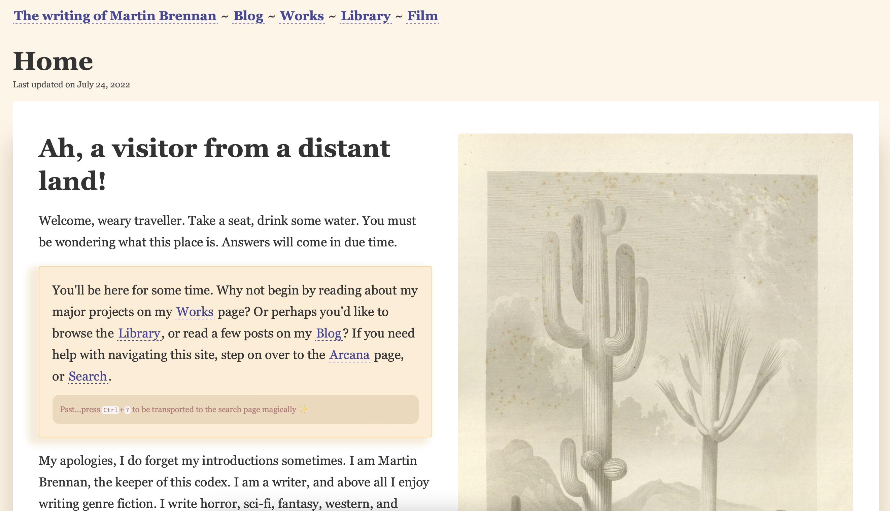
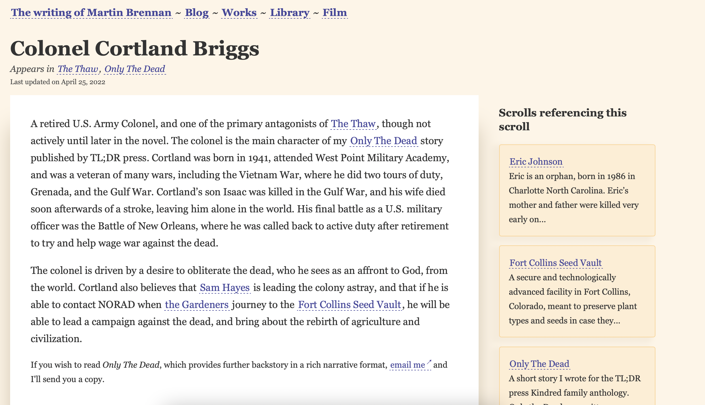

This is the source repo for https://writing.martin-brennan.com , which at the time of writing this README looks like this:

This website serves as a collection of my writing, including:

* Worldbuilding for the fictional worlds and stories I create
* Fully formed essays and traditional blog posts
* Thoughts about books, films, music, and other art

The blog portion of my website can be found at https://writing.martin-brennan.com/blog/, though admittedly entries are sparse.

----

The Jekyll template used to power this website is based on [Setting up your own digital garden with Jekyll](https://maximevaillancourt.com/blog/setting-up-your-own-digital-garden-with-jekyll), though heavily modified and styled, which supports `[[Roam/Obisidian style links]]` which generate backlinks as well as a node graph.

I use this extensively inside the `_notes` directory to make links between worldbuilding and characters for my stories. Links to the current article are displayed in the sidebar:

