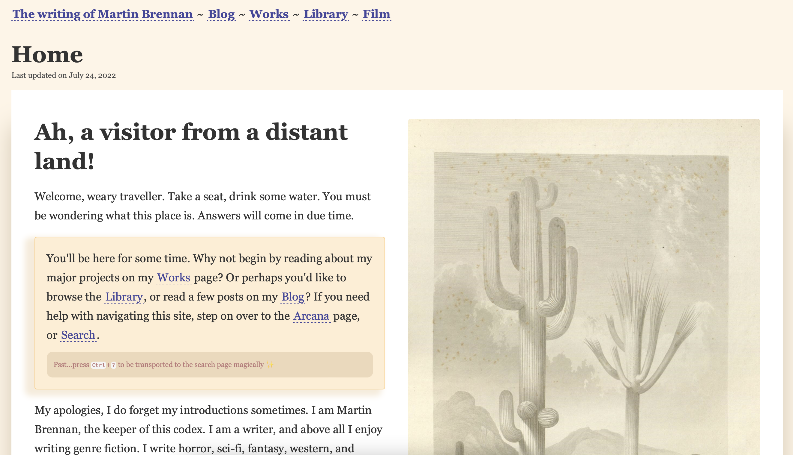
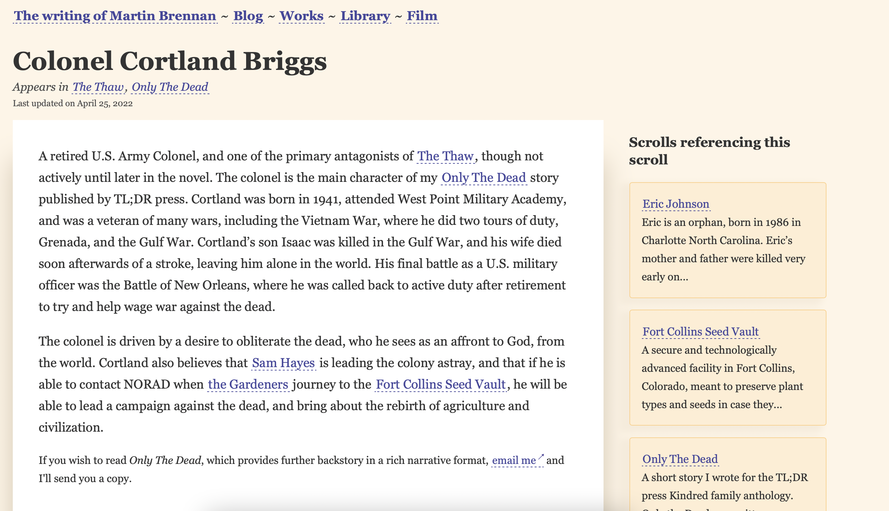

This is the source repo for https://writing.martin-brennan.com , which at the time of writing this README looks like this:

This website serves as a collection of my writing, including:

* Worldbuilding for the fictional worlds and stories I create
* Fully formed essays and traditional blog posts
* Thoughts about books, films, music, and other art

The blog portion of my website can be found at https://writing.martin-brennan.com/blog/, though admittedly entries are sparse.

----

The Jekyll template used to power this website is based on [Setting up your own digital garden with Jekyll](https://maximevaillancourt.com/blog/setting-up-your-own-digital-garden-with-jekyll), though heavily modified and styled, which supports `[[Roam/Obisidian style links]]` which generate backlinks as well as a node graph.

I use this extensively inside the `_notes` directory to make links between worldbuilding and characters for my stories. Links to the current article are displayed in the sidebar:

---

# Instructions to self

### Adding film images

1. Drop the full-size image in `assets/film/` (e.g. `my-photo.jpeg`)
2. Run `ruby manage_film.rb`. For any image not yet in `_data/film.yml`, the script will:
   - Generate a thumbnail in `assets/film/thumbnails/` (skipped if one already exists)
   - Append a new entry to `_data/film.yml` with `slug`, `width`, `height`, and `order` prefilled (order = previous max + 1, so new photos appear first in the gallery)
3. Open `_data/film.yml` and fill in `title` and `description` for each newly appended entry (they're printed at the end of the script output). Optional fields: `camera`, `lens`, `stock`, `approx_date`.

Re-running the script is a no-op when nothing has changed.